# 2 užduotis

# (v1.2)

Šioje programos versijoje realizuotas "Rule of three" (kopijavimo konstruktorius, kopijavimo priskirties operatorius, destruktorius). Programoje taip pat realizuoti ir panaudoti įvestie/išvesties operatoriai.

## Realizuoti metodai ir operatoriai

### Rule of three

Student.h faile, Student klasėje sukurtos šios dalys:  
**Kopijavimo konstruktorius (copy constructor)**  
Konstruktorius perkelia visas kito objekto reikšmes į naujai kuriamą objektą. Taip užtrikrinama, kad naujai sukurtas objektas turi identiškus duomenis, tačiau yra atskiras objektas atmintyje.   
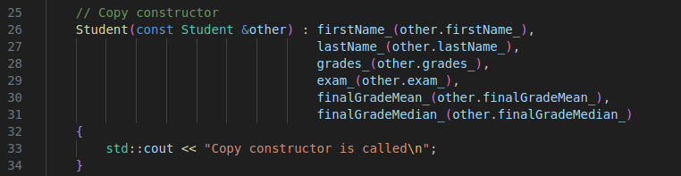

**Kopijavimo priskirties operatorius (copy assignassigment operator)**  
Kopijavimo priskirties operatorius naudojamas tada, kai jau egzistuojančiam Student objektui priskiriamos kito objekto reikšmės.  
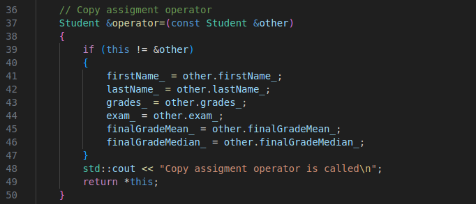

**Destruktorius (destructor)**  
Destruktorius iškviečiamas, kai Student objektas sunaikinamas.  
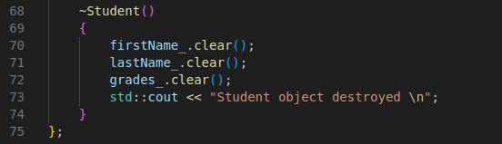

### Įvestie/išvesties operatoriai
Šioje programoje **įvesties operatorius** panaudotas suvesti duomenis į Student objektą naudojant standartinį srautą `std::cin`, kur vartotojas gali surašyti varda, pavardę ir namų darbų bei egzamino balus į vieną eilutę.  
**Išvesties operatorius** leižia Student objektą išvesti į konsolę naudojant `std::cout`.

## Duomenų įvedimo būdai:

### Rankinis duomenų įvedimas
Vartotojas gauna du suvedimo rankiniu būdu pasirinkimus:
1. Suvedimas pažingsniui (t.y. progama klausia vardo, pavardės ir t.t.)
2. Suvesti duomenis į vieną eilutę.

Pasirinkęs **1.**, vartotojas taip pat gali suvesti atsitiktinai generuojamus balus.
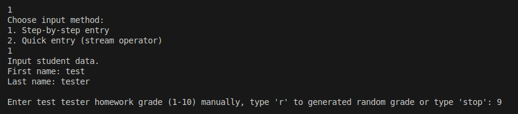

Pasirinkęs **2.**, vartotojas suveda vardą, pavardę, namų darbų ir egzamino balus į vieną eilutę. Tai progamoje realizuota su **įvesties operatorium**.  
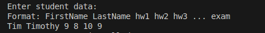

Abejais atvėjais po duomenų įvedimo, programa atspausdina pridėto studento duomenis ekrane (realizuota su **Išvesties operatoriumi**).  
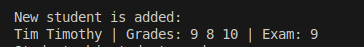

### Įvedimas iš TXT failo
Programa gali nuskaityti studentų duomenis iš failo:  
- failas nuskaitomas eilutė po eilutės
- duomenys išskaidomi ir iš jų sukuriami Student objektai.
  
Failo formatas:  
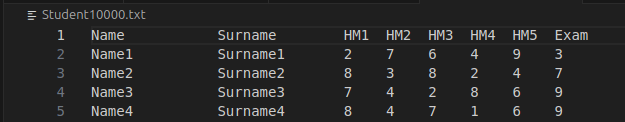

### Automatinis duomenų generavimas
Programa turi funkciją **generateRandomStudentFile()**, kuri automatiškai sukuria tekstinį failą su atsitiktiniais studentų duomenimis.  

Funkcija sukuria naują failą pavadinimu "Student{ivesties_skaičius}.txt".  
Į failą įrašoma antraštės eilutė: studento vardas, pavardė, 5 namų darbų balai, egzamino balas.  
  
Toliau automatiškai sugeneruojama tiek eilučių, kiek nurodo vartotojas.  
  
Kiekvienam studentui vardas ir pavardė generuojami pagal šabloną NameX, SurnameX. 5 namų darbų balai generuojami naudojant getRandomGrade(), egzamino balas taip pat sugeneruojamas atsitiktinai.  
Failas išsaugomas ir vartotojui išvedama žinutė, kad generavimas pavyko.  

## Duomenų išvedimo būdai:

### Duomenų išvedimas į ekraną
Kaip ir minėta ankščiau, programa atspausdina rankiniu būdu įvesto studento duomenis:  
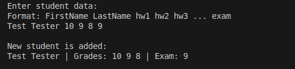  

Programa taip pat atpsausdina studentų sąrašą vartotojui pasirinkus galutinio balo apskaičiavimą:  
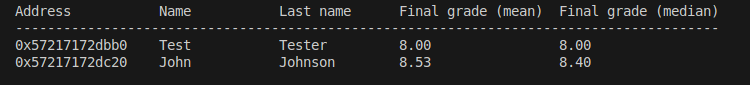  

### Duomenų išvedimas į failą
Studentų sąrašas išvedamas į failą vartotojui pasirinkus surūšiuoti studentus į dvi grupes: "vargšiukus (strugglers)" ir "kietiakius (highachievers)".  
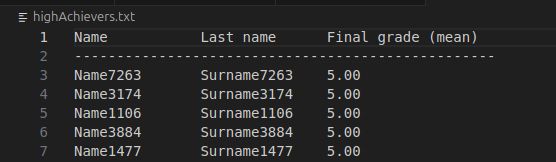
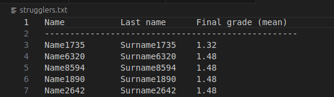
