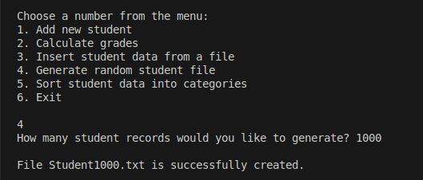
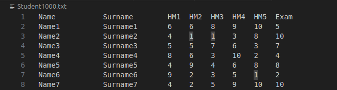

# 2 užduotis

# (v1.5)
Šioje programos versijoje sukurta `Human` abstrakti bazinė klasė ir iš jos išvesta `Student` klasė.

# (v1.2)

Šioje programos versijoje realizuotas "Rule of three" (kopijavimo konstruktorius, kopijavimo priskirties operatorius, destruktorius). Programoje taip pat realizuoti ir panaudoti įvestie/išvesties operatoriai.

## Realizuoti metodai ir operatoriai

### Rule of three

Student.h faile, Student klasėje sukurtos šios dalys:  
**Kopijavimo konstruktorius (copy constructor)**  
Konstruktorius perkelia visas kito objekto reikšmes į naujai kuriamą objektą. Taip užtrikrinama, kad naujai sukurtas objektas turi identiškus duomenis, tačiau yra atskiras objektas atmintyje.   

**Kopijavimo priskirties operatorius (copy assignassigment operator)**  
Kopijavimo priskirties operatorius naudojamas tada, kai jau egzistuojančiam Student objektui priskiriamos kito objekto reikšmės.  

**Destruktorius (destructor)**  
Destruktorius iškviečiamas, kai Student objektas sunaikinamas.  

### Įvestie/išvesties operatoriai
Šioje programoje **įvesties operatorius** panaudotas suvesti duomenis į Student objektą naudojant standartinį srautą `std::cin`, kur vartotojas gali surašyti varda, pavardę ir namų darbų bei egzamino balus į vieną eilutę.  
**Išvesties operatorius** leižia Student objektą išvesti į konsolę naudojant `std::cout`.

## Duomenų įvedimo/išvadimo būdai:

### Rankinis duomenų įvedimas
Vartotojas gauna du suvedimo rankiniu būdu pasirinkimus:
1. Duomenų suvedimas pažingsniui (t.y. progama klausia vardo, pavardės ir t.t.)
2. Duomenų suvedimas į vieną eilutę.

Pasirinkęs **1.**, vartotojas papildomai gali suvesti atsitiktinai generuojamus balus.

Pasirinkęs **2.**, vartotojas suveda vardą, pavardę, namų darbų ir egzamino balus į vieną eilutę. Tai progamoje realizuota su **įvesties operatorium**.  

Abejais atvėjais po duomenų įvedimo, programa atspausdina pridėto studento duomenis ekrane (realizuota su **Išvesties operatoriumi**).  

### Įvedimas iš TXT failo
Programa gali nuskaityti studentų duomenis iš failo (pvz. Student10000.txt):  
- failas nuskaitomas eilutė po eilutės
- duomenys išskaidomi ir iš jų sukuriami Student objektai.
  
Failo formatas:  

### Automatinis duomenų generavimas
Pasirinkus sugeneruoti atsitiktinį studentų sąrašą, vartotojo programa paprašo įvesti norimą įrašų kiekį.  
Programa sukuria tekstinį failą (pavadinimu "Student{ivesties_skaičius}.txt") su atsitiktiniais studentų duomenimis.  
Failas išsaugomas ir vartotojui išvedama žinutė, kad generavimas pavyko.  
  
  
Į failą įrašoma antraštės eilutė: studento vardas, pavardė, 5 namų darbų balai, egzamino balas.    
Kiekvienam studentui vardas ir pavardė generuojami pagal šabloną NameX, SurnameX. 5 namų darbų balai ir egzamino balas generuojami atsitiktinai.  
  
  

### Duomenų išvedimas į ekraną
Kaip ir minėta ankščiau, programa atspausdina rankiniu būdu įvesto studento duomenis:  
  

Programa taip pat atspausdina studentų sąrašą vartotojui pasirinkus galutinio balo apskaičiavimą:  
  

### Duomenų išvedimas į failą
Studentų sąrašas išvedamas į failą vartotojui pasirinkus surūšiuoti studentus į dvi grupes: "vargšiukus (strugglers)" ir "kietiakius (highachievers)". Vartotojas gali nurodyti, pagal ką šie sąrašai bus papildomai surušiuoti: pagal vardą arba pagal galutinį balą.    
  
  

# (v1.1)

### Studentų rūšiavimas į dvi kategorijas naudojant 2 strategiją (vid.):
| Įrašų kiekis | `struct Student` (s) | `class Student` (s) | 
|--------------|----------------------|---------------------| 
| 100 000      | 0.00224749           | 0.00189308
| 1 000 000    | 0.0363789            | 0.035765

### `struct Student` rūšiavimas į dvi kategorijas naudojant 2 strategiją (vid.):
| Įrašų kiekis | -O0 (s)       | -O2 (s)       | -O3 (s)     |
|--------------|---------------|---------------|-------------| 
| 100 000      | 0.00878195    | 0.00209466    | 0.00199536
| 1 000 000    | 0.0940266     | 0.0355345     | 0.0355397

### `class Student` rūšiavimas į dvi kategorijas naudojant 2 strategiją (vid.):
| Įrašų kiekis | -O0 (s)       | -O2 (s)       | -O3 (s)     |
|--------------|---------------|---------------|-------------| 
| 100 000      | 0.00723901    | 0.00154923    | 0.00169285
| 1 000 000    | 0.0887853     | 0.0349026     | 0.0355029

### Failo dydžio palyginimas
| Versija | OPT lygis | Failo dydis |
|---------|-----------|-------------|
| struct  | -O0       |  180 K      |
| struct  | -O2       |  108 K      |
| struct  | -O3       |  128 K      |
| class   | -O0       |  180 K      |
| class   | -O2       |  112 K      |
| class   | -O3       |  132 K      |

# Programos diegimo instrukcija (Unix / Ubuntu OS)
### Reikalavimai
Programai reikalinga:
- C++17 versijos kompiliatorius (`g++`)
- `make` įrankis

### Programos kompiliavimas
- Kompiliuoti su std::vector konteineriu: make arba make vector
- Kompiliuoti su std::list konteineriu: make list

### Programos paleidimas
./student_program

### Išvalyti sugeneruotus failus
make clean

# (v1.0)
Programoje studentų dalijimo į dvi kategorijas buvo naudojama funkcija, kuri atitinka 1 strategiją.
Todėl buvo sukurto dvi naujos funkcijos naudojant 2 ir 3 strategijas. 3 strategija buvo sukurta panaudojant 2 strategiją.

## Rezultatai

- `std::vector` konteinerio atveju 2 ir 3 strategijos veikia sparčiau už 1 strategiją, bet 2 strategija yra optimaliausia.
- `std::list` konteinerio atveju, 2 ir 3 strategijos reikšmingai lenkia 1 strategiją, tačiau jų tarpusavio našumo skirtumas išlieka minimalus. 

### VECTOR Studentų rūšiavimas į dvi kategorijas (vid.):
| Įrašų kiekis | 1 strategija (s) | 2 strategija (s) | 3 strategija (s) |
|--------------|------------------|------------------|------------------|
| 1 000        | 0.000249402      | 0.0000453356     | 0.0000753746  
| 10 000       | 0.00279157       | 0.000420785      | 0.000658982
| 100 000      | 0.01678          | 0.00316335       | 0.00590283
| 1 000 000    | 0.124591         | 0.0336813        | 0.05502
| 10 000 000   | 1.3581           | 0.370949         | 0.574973

### LIST Studentų rūšiavimas į dvi kategorijas (vid.):
| Įrašų kiekis | 1 strategija (s) | 2 strategija (s) | 3 strategija (s) |
|--------------|------------------|------------------|------------------|
| 1 000        | 0.000195842      | 0.000018741      | 0.0000322838
| 10 000       | 0.00156636       | 0.000257923      | 0.000537038
| 100 000      | 0.0174754        | 0.00318448       | 0.00357223
| 1 000 000    | 0.163567         | 0.0285604        | 0.0272477
| 10 000 000   | 1.71859          | 0.278273         | 0.254779

# (v0.3)
Šioje versijoje (`v0.3`) buvo atliktas testavimas, siekiant palyginti `std::vector` ir `std::list` veikimo spartą.
Testavimui naudoti tie patys duomenų failai kaip ir `v0.2` versijoje.  
Kiekvienam konteineriui buvo atliekami matavimai su tokiais įrašų kiekiais (1000, 10000, 100000, 1000000, 10000000 įrašų).

## Testavimo aplinka
| Parametras |  Reikšmė                    | 
|------------|-----------------------------|
| CPU        | Intel(R) Core(TM) i7-1065G7 |
| RAM        | 8 GB                        |
| Diskas     | SSD                         |
| OS         | Ubuntu 24.04.3 LTS          |

## Rezultatai

- Atsitiksinių studentų failų kūrimo atveju `std::vector` ir `std::list` rezultatai labai nesiskyrė. Nedidelių įrašų kiekių (pvz., 1000 ar 10000) atveju skirtumas tarp `std::vector` ir `std::list` buvo vos kelių milisekundžių ribose, todėl galima teigti, kad abiejų konteinerių efektyvumas šiuo atveju beveik identiškas.
- Duomenų nuskaitymo iš failų atveju `std::list` buvo vidutiniškai partesnis už `std::vector`, tačiau šis pranašumas nebuvo labai ženklus.
- Studentų rūšiavimo į dvi kategorijas atveju `std::list` konteineris buvo šiek tiek spartesnis už `std::vector`, ypač didėjant duomenų kiekiui (1 ir 10 milijonų įrašų). Mažesnių duomenų kiekių atveju skirtumas buvo beveik nepastebimas.
- Surūšiuotų studentų išvedimo į du naujus failus atveju `std::vector` konteineris buvo pastebimai spartesnis už `std::list`, ypač kai įrašų kiekis buvo didelis.

Atliktų testų rezultatai parodė, kad `std::vector` ir `std::list` našumas buvo panašus, tačiau `std::list` šiek tiek geriau pasirodė duomenų nuskaitymo ir rūšiavimo etapuose, o `std::vector` buvo efektyvesnis išvedant didelius duomenų kiekius į failus.

Atsitiksinių studentų sąrašų failų kūrimas (vid.):
| Įrašų kiekis | `std::vector` (s) | `std::list` (s) |
|--------------|-------------------|-----------------|
| 1 000        | 0.0017713         | 0.001936278
| 10 000       | 0.00814588        | 0.0110534
| 100 000      | 0.05982952        | 0.06057134
| 1 000 000    | 0.4506244         | 0.4379546
| 10 000 000   | 4.3473            | 4.343814

Duomenų nuskaitymas iš failų (vid.):
| Įrašų kiekis | `std::vector` (s) | `std::list` (s) |
|--------------|-------------------|-----------------|
| 1 000        | 0.002358702       | 0.001804468
| 10 000       | 0.01968436        | 0.01750358
| 100 000      | 0.08291886        | 0.078372
| 1 000 000    | 0.6835998         | 0.561991
| 10 000 000   | 6.60041           | 6.604486

Studentų rūšiavimas į dvi kategorijas (vid.):
| Įrašų kiekis | `std::vector` (s) | `std::list` (s) |
|--------------|-------------------|-----------------|
| 1 000        | 0.000294958       | 0.000172689
| 10 000       | 0.002069002       | 0.00192168
| 100 000      | 0.01242656        | 0.01240088
| 1 000 000    | 0.1211802         | 0.10524554
| 10 000 000   | 1.192148          | 1.1188372

Surūšiuotų studentų išvedimas į du naujus failus (vid.):
| Įrašų kiekis | `std::vector` (s) | `std::list` (s) |
|--------------|-------------------|-----------------|
| 1 000        | 0.002195244       | 0.00879666
| 10 000       | 0.0164007         | 0.01603442
| 100 000      | 0.05875878        | 0.07475656
| 1 000 000    | 0.5272746         | 0.6350894
| 10 000 000   | 4.934834          | 5.80888

# (v0.2)
Atlikus programos spartos testus su skirtingais duomenų failų dydžiais (1 tūkst., 10 tūkst., 100 tūkst., 1 mln. ir 10 mln. įrašų), nustatyta:
- Failų kūrimo laikas auga beveik tiesiškai priklausomai nuo įrašų kiekio.
- Duomenų nuskaitymas užtrunka ilgiau nei kūrimas, ypač su dideliais failais (pvz., 10 mln. įrašų nuskaitymas užtruko vidutiniškai 6,3 s).

| Įrašų kiekis | Atsitiksinių studentų sąrašų failų kūrimo vid. (s) |
|--------------|----------------------------------------------------|
| 1 000        | 0.003338122                                        |
| 10 000       | 0.010401078                                        |
| 100 000      | 0.05856702                                         |
| 1 000 000    | 0.4611562                                          |
| 10 000 000   | 4.250476                                           |

| Įrašų kiekis | Duomenų nuskaitymas iš failų vid. (s) |
|--------------|---------------------------------------|
| 1 000        | 0.002008618                           |
| 10 000       | 0.010693404                           |
| 100 000      | 0.0747804                             |
| 1 000 000    | 0.6019136                             |
| 10 000 000   | 6.308904                              |

| Įrašų kiekis | Studentų rūšiavimas į dvi kategorijas vid. (s) |
|--------------|------------------------------------------------|
| 1 000        | 0.000288262                                    |
| 10 000       | 0.001714236                                    |
| 100 000      | 0.01753584                                     |
| 1 000 000    | 0.1313298                                      |
| 10 000 000   | 1.46565                                        |

| Įrašų kiekis | Surūšiuotų studentų išvedimas į du naujus failus vid. (s) |
|--------------|-----------------------------------------------------------|
| 1 000        | 0.001948826                                               |
| 10 000       | 0.013065428                                               |
| 100 000      | 0.06703692                                                |
| 1 000 000    | 0.5017516                                                 |
| 10 000 000   | 4.878024                                                  |

# (v0.1)
Šiame release programa patobulinta taip, kad vartojas galetų nuskaityti studentų duomenis is txt failo.
Nuskaityti duomenys išvedami į tą pati lentelės pavidalą kaip ir v.pradine versijoje:

|Name    |Surname   |Final grade (mean)  |Final grade (median)  |
|--------|----------|--------------------|----------------------|
|Name1   |Surname1  |8.00                |8.00                  |
...

Studentų duomenys yra rušioujami pagal vardą.

Buvo sėkmingai atidaryti visi testavimo failai:
- studentai10000.txt
- studentai100000.txt 
- studentai1000000.txt

# (v.pradine)
Programa  priema studento vardą ir pavardę, namų darbų tarpinius rezultatus ir egzamino rezultatą, ir iš balų išveda galutinį balą.
Išvedama lentelė su studentų vardais ir galutiniu balu paskaičiuotu pagal varotojo pasirinkimą (Galutinis (Vid.) arba Galutinis (Med.) ar abudu). Galutiniais balais suskaičiuotais pagal formulę:
Galutinis = 0.4 * vidurkis + 0.6 * egzaminas